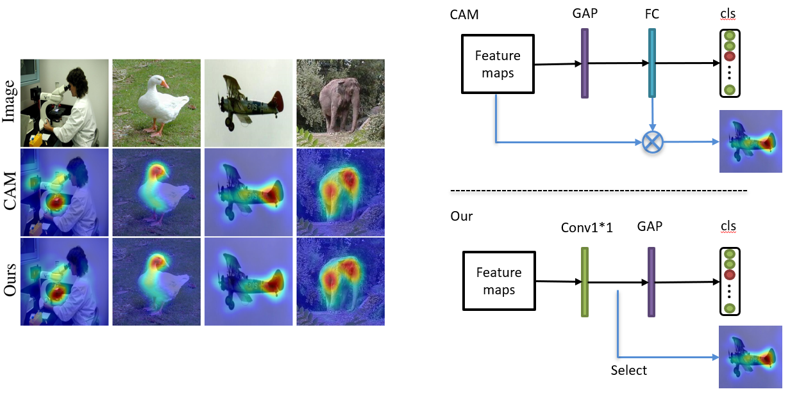
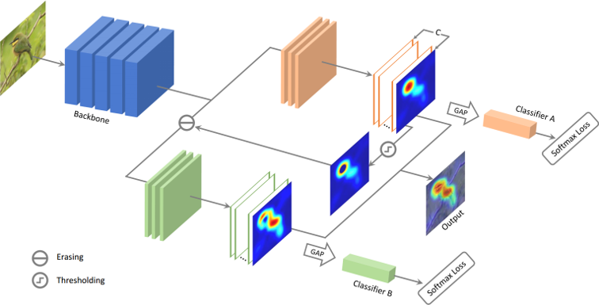
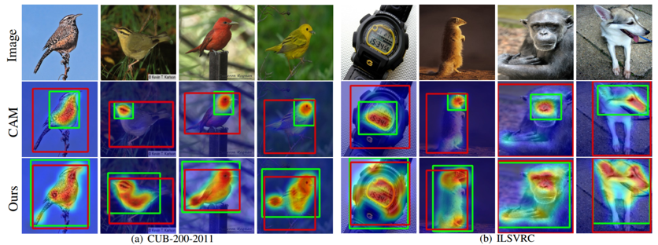
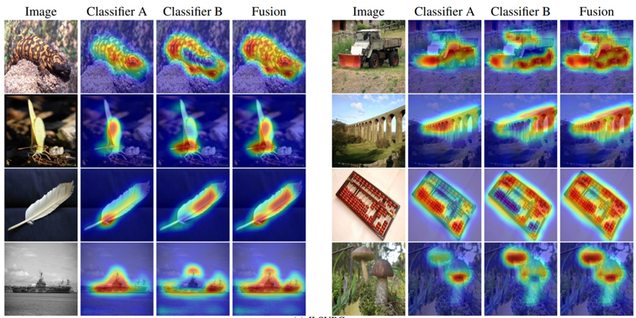

# [Adversarial Complementary Learning for Weakly Supervised Object Localization](http://openaccess.thecvf.com/content_cvpr_2018/papers/Zhang_Adversarial_Complementary_Learning_CVPR_2018_paper.pdf)

## Revisiting [CAM](http://cnnlocalization.csail.mit.edu/Zhou_Learning_Deep_Features_CVPR_2016_paper.pdf)
We prove the CAM method can be simplified to enable end-to-end training. The proof refers to [Section 3.1](http://openaccess.thecvf.com/content_cvpr_2018/papers/Zhang_Adversarial_Complementary_Learning_CVPR_2018_paper.pdf).


## The proposed ACoL method
We apply two classifiers to discover complementary regions of target objects.


## Localization


## Effect of mining complementary regions


## Prerequisites
- Python2.7
- PyTorch
- tqdm

## Data Preparation

- Download the ILSVRC dataset and save them to $data$

## Train
```
git clone https://github.com/xiaomengyc/ACoL.git
cd ACoL
mkdir snapshots
```

### Citation
If you find this code helpful, please consider to cite this paper:
```
@inproceedings{zhang2018adversarial,
  title={Adversarial complementary learning for weakly supervised object localization},
  author={Zhang, Xiaolin and Wei, Yunchao and Feng, Jiashi and Yang, Yi and Huang, Thomas},
  booktitle={IEEE CVPR},
  year={2018}
}
```
